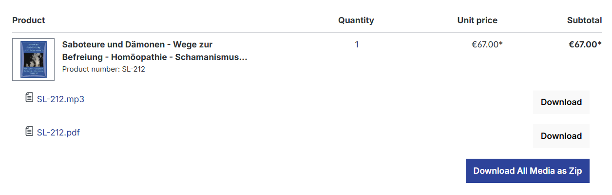
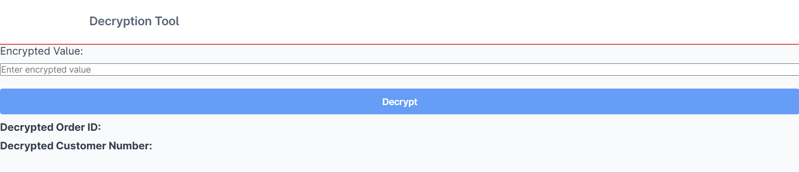

# **Plugin: HomsymCustomDownload**

This is a highly advanced plugin for the Shopware 6 platform, an open-source eCommerce solution. 
It is designed specifically for managing downloadable e-products such as eBooks, PDFs, MP3 files, and more. 
This plugin has been developed exclusively for Verlag Homöopathie + Symbol.

Author: Hang Truong (2025)

Version: 1.0.0

Contact: thanhhang2x2@gmail.com

## **Table of Contents**
1. [Introduction](#introduction)
2. [Installation](#installation)
3. [Technic Information](#technic information)
4. [Usage](#usage)
5. [Troubleshooting](#troubleshooting)
6. [Contributing](#contributing)
7. [License](#license)

## **Introduction**

**Main Function: Download Media (for Downloadable Products) as a ZIP File**

In Shopware 6, downloadable products (e-products) are still a relatively new feature, and there are currently few extensions available to enhance their functionality. By default, Shopware only allows users to download individual media files from a product, rather than all associated media at once.

This plugin introduces the ability to download all media files of a product as a ZIP archive, making the download process faster, easier, and more efficient. Additionally, it improves download management and security, enabling better control over:

- Who has downloaded the files

- Secure-key verification

**Key Features:**

✔ Frontend & Backend Implementation

✔ Encryption Logic for MP3 Products

✔ Log File for Debugging & Customer Information Tracking

✔ Admin Decryption Tool

✔ Multilingual Support (English & German Snippets)


## **Installation**

### **Requirements**
- Shopware 6 
- Updated Database: 'order_line_item', 'order_line_item_download' 
- Database 'order_line_item_download': If products are stored in a dedicated folder corresponding to their product number,
I have developed a PHP tool available on my GitHub, which automates the transfer of files into this table.

### **Steps**
1. Download the plugin or clone the repository.
2. Upload the plugin to the `custom/plugins/` directory.
3. Navigate to **Shopware Admin > Extensions > My Extensions** and install the plugin.
4. Activate the plugin.

Alternatively, install via CLI:
```sh
bin/console plugin:install --activate HomsymCustomDownload
```
5. Test the Download-Zip in Storefront and check log to see infos or errors

## **Technic Information**

- DownloadZipRoute: The main class responsible for handling the core logic of the download process. It orchestrates the packaging of downloadable products into a ZIP file.

- RouteAPI: Used for routing and creating an API endpoint between the frontend and backend, ensuring seamless communication and file delivery.

- Repository: Interacts with the database to store and retrieve download-related information, including tracking download records.

- Encryption Logic: Implements a robust encryption mechanism for securing sensitive product media (e.g., MP3 files) during the download process or tracking back orderID.

- Admin Decryption Tool: Provides an easy-to-use tool for administrators to decrypt encrypted code

- Logging Mechanism: Captures detailed logs for debugging, user download activity, and error tracking, helping both administrators and developers monitor the download process.

- Multilingual Support: Snippets for both English and German are integrated to ensure the plugin can be used in multiple languages.

- Performance Optimizations: The plugin is designed to handle large product media efficiently, including optimized file packaging and download management to reduce server load.

- Compatibility: Fully compatible with Shopware 6, ensuring it integrates seamlessly with the platform’s existing download management system.

- ....
## **Usage**

1. Click 'Download All Media as Zip'

   (User clicks the button to start the download process.)


2. Condition Page Pops Up

   (A condition page appears before the download starts.)


3. Download Process

    

   (The download progress is calculated until the ZIP file is fully downloaded.)


4. Decryption Tool 

   (The decryption tool can be accessed in the customer menu.)


5. Decryption Tool in Admin View

   (Admin can also manage decryption in the admin panel.)

## **Troubleshooting**

Updated version: 1.0.1 (Backend, Snippet updates) (Please contact privately for updated version) 

## **Contributing**

Contributions to the plugin are welcome and encouraged. If you'd like to contribute or extend its functionality, please refer to the Technical Information section for further details.

For access to the Plugin Developer Documentation, please contact me privately.

## **License**

- Shopware 6
- Using library GetID3 from : https://github.com/JamesHeinrich/getID3/tree/master
- Ownership: The plugin is owned by me(Hang Truong) and Verlag Homöopathie + Symbol

- Before republishing this plugin, or including it in another repository, please contact me to discuss the licensing terms or add this Github's link in your extended Plugin's README license https://github.com/Hangtruongg/Shopware_Plugin_DownloadZip